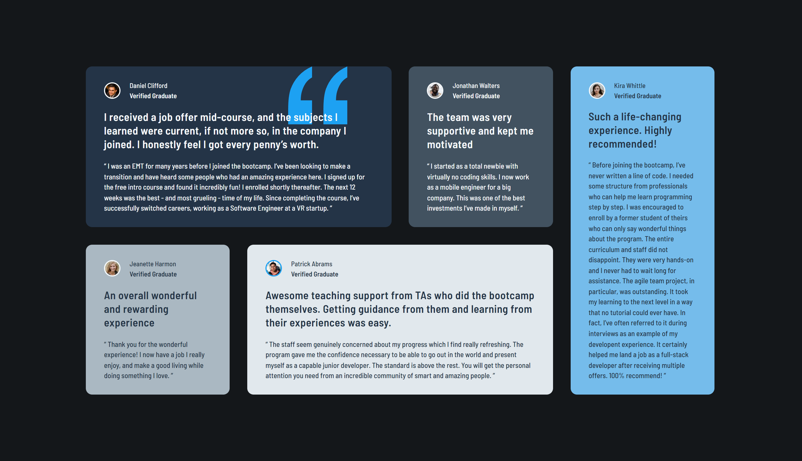

# Testimonial Grid ✈️

## Layout

The designs were created to the following widths:

- Desktop: 1440px
- Mobile: 375px

## Links

- Solution URL: [https://github.com/eigdoyr/testimonial-grid](https://github.com/eigdoyr/testimonial-grid)
- Live Site URL: [https://eigdoyr-testimonial-grid.netlify.com](https://eigdoyr-testimonial-grid.netlify.com)

## Built with

- [Vue](https://vuejs.org/)
- [Vite](https://vitejs.dev/)
- Semantic HTML5 markup
- CSS custom properties
- Flexbox
- CSS Grid
- Mobile-first workflow
